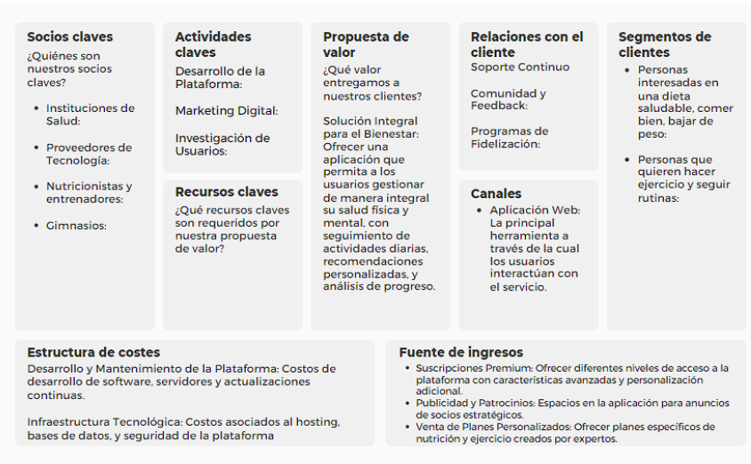
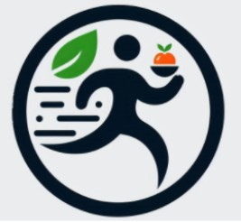

<h1 style="text-align: center;"> Informe del Trabajo Final </h1>
<h3 style="text-align: center;"> Universidad Peruana de Ciencias Aplicadas </h3>

<h5 style="text-align: center"> Área: Ingeniería de Software </h5>

<h5 style="text-align: center"> Curso: Fundamentos de Arquitectura de Software </h5>
<h5 style="text-align: center"> Sección: 3587 </h5>

<h5 style="text-align: center"> Docente: Ernesto Ocampo Tello</h5>

<h5 style="text-align: center"> Startup: HealthLife </h5>

<h5 style="text-align: center"> Producto: HealthLife </h5>

## Team members:

|                Nombre                 |   Código   |
| :-----------------------------------: | :--------: |
| Reyes Valnzuela, Renato German | U20221B471 |
|  Luza Carhuamaca, Jose Adrian      | U202213404 |
|  Cruz Ticona, Aaron Alejandro | U202213502 |
|       (Usuario)  | U202221876 |

<h5 style="text-align: center"> Ciclo 2024-02 </h5>

# Registro de Versiones del Informe

El objetivo de esta sección es resumir las modificaciones relevantes que se realizan al informe durante el ciclo de vida del proyecto. Esta sección inicia en una página nueva y se incluye un cuadro con la siguiente estructura:

| Versión |   Fecha    |                 Autor                 | Descripción de modificación                                                                                                                                                          |
| :-----: | :--------: | :-----------------------------------: | ------------------------------------------------------------------------------------------------------------------------------------------------------------------------------------ |

## Project Report Collaboration Insights

URL del repositorio para el reporte del proyecto:

https://github.com/Nato0211/HealthLife.git

**TB1**

Para el desarrollo del informe perteneciente a la entrega TB1, se dividió la implementación de secciones de la siguiente forma para cada integrante del equipo:

| Integrante                            | Tareas Asignadas                                                                                                                           |
| ------------------------------------- | ------------------------------------------------------------------------------------------------------------------------------------------ |
| (Nombre) |(Tareas)                   |
| (Nombre)       | (Tareas)|
| (Nombre)          | (Tareas)  |
| (Nombre)   | (Tareas)|
|(Nombre)   | (Tareas)  |

Los integrantes son:

- Reyes Valenzuela Renato German| (Nato0211)
- Luza Carhuamaca, Jose Adrian | (Adrianluza1)
-  | (Usuario)
-  | (Usuario)

## STUDENT OUTCOME

## Contenido

1. [**Capítulo I: Introducción.**](#1.)  
   1.1. [Startup Profile.](#1.1.)  
   1.1.1. [Descripción del startup.](#1.1.1.) 
   1.1.2.[Perfiles de los integrantes del equipo.](#1.1.2.) 
   1.2. [Solution Profile.](#1.2.) 
   1.2.1. [Antecedentes y Problemática.](#1.2.1.) 
   1.2.2. [Lean UX Process.](#1.2.2.) 
   1.2.2.1 [LEntrevistasts.](#1.2.2.1.) 
   1.2.2.2. [Lean UX Assumptions.](#1.2.2.2.) 
   1.2.2.3 [Lean UX Hypothesis Statements.](#1.2.2.3.) 
   1.2.2.4 [Lean UX Canvas.](#1.2.2.4.) 
   1.3. [Segmentos objetivo.](#1.3.) 
2. [**Capítulo II: Requirements Elicitation & Analysis.**](#2.) 
   2.1. [Competidores.](#2.1.) 
   2.1.1. [Análisis competitivo.](#2.1.1.) 
   2.1.2. [Estrategias y tácticas frente a competidores.](#2.1.2.) 
   2.2. [Entrevistas.](#2.2.) 
   2.3. [Needfinding.](#2.3.) 
   2.3.1. [User Personas.](#2.3.1.) 
   2.3.2. [User Task Matrix.](#2.3.2.) 
   2.3.3. [Empathy Mapping.](#2.3.3.) 
   2.3.5. [As-is Scenario Mapping.](#2.3.5.) 

<h2>Capítulo I: Introducción</h2>

<h3> 1.1 Startup Profile.</h3>

En esta sección se detalla la presentación general del startup y los perfiles del equipo que lo conforma.

<h4> 1.1.1. Descripción del startup.</h4>

HealthLife es una empresa emergente de base tecnológica que busca revolucionar la forma en que las personas manejan su salud integral. Su producto principal, **HealthLife**, es una plataforma web que permite registrar, monitorear y analizar rutinas diarias vinculadas al bienestar, incluyendo actividad física, alimentación y descanso.

**Misión:**  
Brindar a los usuarios el poder de gestionar su bienestar físico y mental a través de herramientas digitales fáciles de usar, respaldadas por información personalizada que facilite el logro de objetivos saludables.

**Visión:**  
Posicionarnos como la aplicación de referencia en el ámbito del bienestar personal, reconocida internacionalmente por su innovación y capacidad para adaptar sus soluciones a las necesidades individuales de cada usuario, promoviendo así una mejor calidad de vida.

    <h4>1.1.2. Perfiles de los integrantes del equipo</h4>

<table border="1" width="70%" style="margin: auto; text-align: center; border-collapse: collapse;">
    <!-- Integrante 1 -->
    <tr>
        <td rowspan="3" style="width: 300px;">
            
        </td>
        <td align="left">
            <b>Nombre y Apellido:</b> 
            Reyes Valenzuela Renato German
        </td>
    </tr>
    <tr>
        <td align="left">
            <b>Carrera:</b> 
            Ingeniería de Software
        </td>
    </tr>
    <tr>
        <td align="left">
            <b>Acerca de:</b> 
            Mi nombre es Renato German Reyes Valenzuela y tengo 23 años. Soy estudiante de la carrera de Ingeniería de Software de la UPC (Universidad Peruana de Ciencias Aplicadas). Estoy en el sexto ciclo de mi carrera. Gracias a los cursos que estuve llevando los últimos ciclos, más el aprendizaje extracurricular, cuento con la capacidad y conocimientos para desarrollarme correctamente con los avances y desarrollo de la propuesta de trabajo que ofrecemos. Por último, destaco mi capacidad de empatía y compañerismo para poder avanzar de manera grupal los sprint correspondientes y apoyarme en lo necesario con mis compañeros.
        </td>
    </tr>

   <tr>
        <td rowspan="3">
            
        </td>
        <td align="left">
            <b>Nombre y Apellido:</b> 
            Luza Carhuamaca, Jose Adrian
        </td>
    </tr>
    <tr>
        <td align="left">
            <b>Carrera:</b> 
            Ingeniería de Software
        </td>
    </tr>
    <tr>
        <td align="left">
            <b>Acerca de:</b> 
            Me llamo Jose Luza, estoy en el 7mo ciclo de la carrera de Ingeniería de Software. Me gusta la idea de que con la programación se pueden llegar a crear muchas cosas útiles. Soy una persona ágil, responsable y transparente que trabaja bien en equipo.
        </td>
    </tr>

   <tr>
        <td rowspan="3">
            
        </td>
        <td align="left">
            <b>Nombre y Apellido:</b> 
            Cruz Ticona, Aaron Alejandro
        </td>
    </tr>
    <tr>
        <td align="left">
            <b>Carrera:</b> 
            Ingeniería de Software
        </td>
    </tr>
    <tr>
        <td align="left">
            <b>Acerca de:</b> 
            Mi nombre es Aaron Cruz, estoy cursando el 7mo ciclo, me considero una persona abierta a nuevas experiencias, responsable y en especial, con ganas de ampliar mis conocimientos mientras desarrollamos el proyecto en compañía de un trabajo colaborativo eficaz.
        </td>
    </tr>

   <tr>
        <td rowspan="3">
            
        </td>
        <td align="left">
            <b>Nombre y Apellido:</b> 
            Mathias Vasquez
        </td>
    </tr>
    <tr>
        <td align="left">
            <b>Carrera:</b> 
            Ingeniería de Software
        </td>
    </tr>
    <tr>
        <td align="left">
            <b>Acerca de:</b> 
            Mi nombre es Mathias Vasquez, estoy cursando el 7mo ciclo, me considero una persona abierta a nuevas experiencias, responsable. Siempre me esfuerzo cada día para superarme más y aprender nuevas cosas.
        </td>
    </tr>
</table>

<h3> 1.2. Solution Profile.</h3>

<h4> 1.2.1. Antecedentes y Problemática.</h4>

**Antecedentes:**  
A nivel mundial, muchas personas muestran interés en mejorar su bienestar a través de la actividad física y una mejor alimentación. Sin embargo, aunque reconocen el rol fundamental de la dieta en el control de peso, tienden a centrar sus esfuerzos únicamente en disminuir o evitar el azúcar, dejando de lado un enfoque nutricional más completo. (N.d.). Ipsos.com. (2021, Enero 18).

**Problemática:**  
Aunque existe una motivación general por adoptar hábitos saludables, muchas personas tienen dificultades para implementar cambios duraderos en su alimentación, enfocándose principalmente en eliminar el azúcar en lugar de aplicar una estrategia integral para lograr sus objetivos.

**WHAT (Qué): ¿Cuál es el problema?**  
El problema es que, si bien hay interés por mejorar la salud, las personas no aplican cambios alimenticios más amplios o sostenibles, limitándose a reducir el azúcar como única medida.

**WHEN (Cuándo): ¿Cuándo sucede el problema?**  
El problema aparece cuando las personas deciden cambiar su estilo de vida para perder peso o mejorar su salud, pero no saben cómo hacerlo de manera adecuada o sostenible.

**WHERE (Dónde): ¿Dónde surge el problema?**  
Este problema se presenta en distintos países y contextos, siendo más evidente en lugares donde la información sobre nutrición es limitada, poco clara o confusa.

**WHO (Quién): ¿A quiénes les sucede el problema?**  
Afecta a personas de todas las edades y géneros que desean mejorar su salud pero no cuentan con el conocimiento o las herramientas necesarias para lograrlo correctamente.

**WHY (Por qué): ¿Cuál es la causa del problema?**  
La principal causa es la falta de acceso a información confiable y a planes alimenticios integrales, lo que lleva a la población a enfocarse solo en el azúcar como principal enemigo del peso y la salud.

**HOW (Cómo): ¿Cómo llevó a los involucrados a llegar a esta situación?**  
La influencia de modas alimenticias, mensajes publicitarios poco precisos y una educación nutricional deficiente han hecho que muchas personas asuman que eliminar el azúcar es suficiente para estar saludables.

**HOW MUCH (Cuánto): ¿Cuánto afecta el problema?**  
Este enfoque limitado afecta significativamente los resultados en la pérdida de peso y mejora de salud. Al no obtener los resultados esperados, las personas pueden sentirse frustradas y abandonar sus esfuerzos por cambiar su estilo de vida.

<h4> 1.2.2. Lean UX Process</h4>

<h5> 1.2.2.1. Lean UX Problem Statements</h5>

Nuestro servicio se enfoca en promover el bienestar y la salud a través de una aplicación que permite a los usuarios registrar actividades como la alimentación y el ejercicio para llevar un seguimiento constante de su progreso.

Hemos identificado un desafío crítico que afecta la efectividad del servicio y la satisfacción del usuario: la falta de constancia y motivación para registrar las actividades diariamente. A pesar de los múltiples métodos de registro que existen, muchas personas no logran mantener un registro continuo, lo que reduce su progreso.

¿Cómo podemos mejorar la constancia de los usuarios en el registro de sus actividades diarias y, al mismo tiempo, incrementar su motivación para mantener un seguimiento regular de su bienestar, logrando que se sientan más comprometidos y satisfechos con el servicio?

<h5> 1.2.2.2. Lean UX Assumptions.</h5>

**Business Assumptions** 

- Creemos que nuestros usuarios necesitan una manera más eficiente y personalizada de gestionar su bienestar físico y mental.
- Estas necesidades se pueden resolver mediante el uso de una aplicación web que registre y analice actividades diarias como ejercicio, alimentación y sueño, ofreciendo recomendaciones personalizadas basadas en estos datos.
- Los usuarios iniciales son personas activas o que desean mejorar su salud y bienestar mediante el seguimiento y análisis de sus actividades diarias.
- El valor #1 que un usuario busca en el servicio es la capacidad de tener un control integral sobre su bienestar, con información y recomendaciones que les permitan alcanzar sus objetivos de salud de manera efectiva.
- El usuario también puede obtener beneficios adicionales con funcionalidades como el seguimiento de metas, alertas para hábitos saludables, y la integración con dispositivos de fitness, lo que les permitirá mejorar su estilo de vida de manera continua y holística.
- Vamos a adquirir la mayoría de los usuarios a través de campañas de marketing digital, asociaciones con gimnasios y nutricionistas, y la creación de contenido educativo sobre salud y bienestar que aumente la visibilidad de la aplicación.
- Se hará dinero a través de las ventas de suscripciones a diferentes niveles de acceso a la plataforma, incluyendo planes premium con características avanzadas y personalización adicional.
  -Nuestra competencia principal en el mercado serán otras aplicaciones de bienestar que no ofrecen una personalización profunda o que carecen de análisis detallados de actividades diarias.
- Los superaremos mediante el uso de tecnologías avanzadas de análisis de datos, un enfoque centrado en el usuario, y la integración con múltiples dispositivos y plataformas, ofreciendo un servicio que se adapta continuamente a las necesidades de los usuarios.
- Nuestro mayor riesgo es la falta de adherencia por parte de los usuarios, quienes podrían desmotivarse si no ven resultados rápidos o si la aplicación es demasiado compleja de usar.
- Resolveremos esto mediante un diseño intuitivo y motivador, además de proporcionar guías y soporte continuo para que los usuarios puedan aprovechar al máximo la aplicación desde el primer día.

**Assumptions worksheet** 

- ¿Quién es el usuario?
  Personas activas o que buscan mejorar su salud y bienestar mediante el seguimiento de sus actividades diarias.\*\*
- ¿Dónde encaja nuestro producto en su vida?
  Nuestra aplicación se integra en la vida diaria de los usuarios para registrar y analizar sus actividades de ejercicio, alimentación y sueño, ofreciendo recomendaciones que los ayudan a mejorar su bienestar general.\*\*
- ¿Qué problemas tiene nuestro producto? ¿Resolver?
  La falta de motivación y adherencia a largo plazo puede ser un desafío para algunos usuarios. También, la complejidad de uso podría desanimar a usuarios menos tecnológicos.
- ¿Cuándo y cómo es nuestro producto usado?
  La aplicación se utiliza a diario para registrar actividades, revisar gráficos de progreso, y recibir recomendaciones personalizadas. Los usuarios pueden acceder a ella desde cualquier dispositivo conectado a internet.
- ¿Qué características son importantes?
  Personalización de recomendaciones, integración con dispositivos de fitness, accesibilidad en múltiples plataformas, gráficos de progreso intuitivos, y alertas automáticas para hábitos saludables.
- ¿Cómo debe verse nuestro producto y cómo comportarse?
  Debe tener un diseño limpio, motivador y fácil de usar, con una interfaz que promueva la acción y el seguimiento continuo. La aplicación debe ser rápida, fiable y ofrecer una experiencia de usuario fluida en cualquier dispositivo.

<h5> 1.2.2.3. Lean UX Hypothesis Statements.</h5>

- Creemos que al implementar un sistema de recompensas por cumplir con metas de actividad diaria, los usuarios estarán más motivados para mantener un registro constante en la aplicación de bienestar y salud. Sabremos que estamos en lo correcto cuando veamos un aumento del 20% en la cantidad de metas alcanzadas por los usuarios.

- Creemos que al integrar gráficos de progreso más visuales y fáciles de entender, los usuarios se sentirán más incentivados a continuar registrando sus actividades diarias. Sabremos que estamos en lo correcto cuando veamos un incremento del 15% en la frecuencia con la que los usuarios revisan su progreso, medido a través de métricas de interacción con los gráficos.

- Creemos que al ofrecer recomendaciones personalizadas basadas en los patrones de actividad y preferencias individuales, los usuarios encontrarán más valor en la aplicación y serán más constantes en su uso. Sabremos que estamos en lo correcto cuando veamos un aumento del 25% en la tasa de adopción de las recomendaciones sugeridas por la aplicación.

<h5> 1.2.2.4. Lean UX Canvas.</h5>

<h3> 1.3. Segmentos objetivos</h3>

**Segmento 1: Abogados Especializados en Derecho Médico**

**Aspectos Demográficos:**
- **Sexo:** Masculino y Femenino
- **Edad:** Entre 30 y 55 años
- **Nivel Socioeconómico:** Clases A y B (Clase alta y clase media alta)
- **Ocupación:** Abogados especializados en derecho médico o aquellos en proceso de especialización.
  
**Aspectos Geográficos:**
- **Nacionalidad:** Peruana
- **Zona Geográfica de Residencia:** Urbana
- **Departamento:** Lima Metropolitana

**Aspectos Psicográficos:**

- Abogados con un alto nivel de compromiso con su especialización en derecho médico.
- Abogados que buscan herramientas tecnológicas que permita gestionar la carga de trabajo.
- Profesionales que valoran la actualización constante sobre legislación en el campo médico.
- Abogados que priorizan la eficiencia, la seguridad y la confidencialidad en la comunicación con clientes.

**Aspectos Conductuales:**
- **Uso de tecnología:** Utilizan herramientas digitales para gestionar casos y están abiertos a nuevas soluciones tecnológicas que mejoren su eficiencia.
- **Preferencias de trabajo:** Prefieren soluciones de software que les permitan trabajar de forma remota o gestionar sus casos desde una perspectiva moderna.
- **Comportamiento de compra:** Dispuestos a pagar servicios que mejoren su eficiencia y les proporcionen acceso a información de alta calidad.

 

**Segmento 2: Doctores que Enfrentan Problemas Legales por Mala Praxis**

**Aspectos Demográficos:**
- **Sexo:** Masculino y Femenino
- **Edad:** Entre 35 y 60 años
- **Nivel Socioeconómico:** Clases A y B (Clase alta y clase media alta)
- **Ocupación:** Médicos de diversas especialidades.

**Aspectos Geográficos:**
- **Nacionalidad:** Peruana
- **Zona Geográfica de Residencia:** Urbana
- **Departamento:** Lima Metropolitana.

**Aspectos Psicográficos:**
- Médicos que buscan defensa legal especializada en su campo y valoran la atención personalizada de abogados con experiencia en su especialidad médica.
- Profesionales del sector salud que priorizan la confidencialidad, la confianza y la seguridad en las comunicaciones legales.
- Médicos que están comprometidos con la resolución rápida y eficiente de los problemas legales que enfrentan, sin comprometer su integridad profesional.

**Aspectos Conductuales:**
- **Preocupación por la reputación profesional:** Tienen un alto nivel de preocupación por su imagen profesional.
- **Uso de tecnología:** Abiertos a plataformas digitales que les proporcionen acceso a abogados especializados para manejar sus preocupaciones.
- **Comportamiento de compra:** Dispuestos a invertir en servicios legales especializados.

<h2>Capítulo II: Requirements & Analysis</h2>

<h3> 2.1. Competidores.</h3>

En esta sección, iniciaremos con en el proceso de identificar y comprender los requisitos necesarios para el servicio. Este proceso implica técnicas como entrevistas y análisis de datos para recopilar información relevante de los usuarios y stakeholders. Luego, estos requisitos se analizan y priorizan para convertirlos en especificaciones claras y alcanzables que guíen el desarrollo del servicio. Este enfoque es fundamental para asegurar que el producto final satisfaga las necesidades y requerimientos que puede tener el usuario y cumpla con los objetivos del negocio de manera efectiva.

<h4> 2.1.1. Análisis competitivo.</h4>

 

Estos son:

  

- **Competidor 1:**
     
  Nombre: Cronometer
   
  Descripción: Sitio web diseñado para ayudar a los usuarios a llevar un registro detallado de sus actividades diarias relacionadas con la alimentación y el ejercicio.
    

Características: Posee un registro para ver el progreso de tus actividades físicas y tu alimentación.
Canal de distribución principal: Web  

Posee un registro para ver el progreso de tus actividades físicas y tu alimentación

   

  

  

- **Competidor 2:**
   
  Nombre: Lose it!
   
  Descripción: Sitio web dedicado a ayudar a los usuarios a perder peso y mantener un estilo de vida saludable mediante el seguimiento de calorías y actividades físicas.
   
  Características: Enfocado más en la pérdida de peso mediante el registro de calorías diarias

Canal de distribución principal: Web  

Enfocado más en la pérdida de peso mediante el registro de calorías diarias
 

  

  

- **Competidor 3:**
  
   
  Nombre: Spark People
   
  Descripción: Sitio web que ofrece herramientas de seguimiento de salud y fitness, junto con una comunidad activa para el soporte mutuo. 

Características: Canal de distribución principal: Web  

Comunidad altamente activa y la ayuda mutua de los clientes mediante recomendaciones de alimentación o rutinas de ejercicios
 

  

  

| Aspecto                      | **NutriMove**                                                                                                                                        | **Cronometer**                                                                                        | **Lose It!**                                                                                                  | **SparkPeople**                                                                                                                |
| ---------------------------- | ---------------------------------------------------------------------------------------------------------------------------------------------------------------------------------------------------- | ----------------------------------------------------------------------------------------------------------------------------------------------------------------- | ----------------------------------------------------------------------------------------------------------------------------------------------------------------- | --------------------------------------------------------------------------------------------------------------------------------------------------------------------------------------- |
| **Overview**                 | Sitio web diseñado para ayudar a los usuarios a llevar un registro detallado de sus actividades diarias relacionadas con la alimentación y el ejercicio.                                             | Sitio web que permite a los usuarios hacer un seguimiento detallado de su ingesta de alimentos y nutrientes, así como de sus actividades físicas.                 | Sitio web dedicado a ayudar a los usuarios a perder peso y mantener un estilo de vida saludable mediante el seguimiento de calorías y actividades físicas.        | Sitio web que ofrece herramientas de seguimiento de salud y fitness, junto con una comunidad activa para el soporte mutuo.                                                              |
| **Ventaja Competitiva**      | Personalización profunda que ofrece en las recomendaciones de salud y bienestar, utilizando datos recogidos de la actividad diaria de los usuarios.                                                  | Enfoque en la precisión del seguimiento de micronutrientes y base de datos científica.                                                                            | Simplicidad y enfoque en la pérdida de peso.                                                                                                                      | Comunidad activa y soporte social, lo que fomenta la motivación y la adherencia a los programas de salud y bienestar.                                                                   |
| **Mercado Objetivo**         | Personas preocupadas por su alimentación y personas que desean llevar un control de sus entrenamientos.                                                                                              | Usuarios interesados en un control detallado de su dieta y usuarios preocupados por su salud general.                                                             | Personas que desean perder peso de manera sencilla.                                                                                                               | Personas que buscan perder peso, mejorar su salud general, y aquellos que valoran el soporte comunitario en su búsqueda de bienestar.                                                   |
| **Estrategias de Marketing** | Campañas digitales dirigidas, utilizando redes sociales, publicidad en motores de búsqueda, y marketing de contenido para atraer a usuarios que busquen mejorar su salud.                            | Publicidad, marketing de contenidos que resalta la precisión y el rigor científico de su plataforma, y colaboración con profesionales de la salud y la nutrición. | Publicidad en redes sociales, marketing de afiliación, y colaboraciones con influencers en el ámbito del fitness y la pérdida de peso.                            | Publicidad digital, y programas de afiliación que incentivan la participación comunitaria.                                                                                              |
| **Productos & Servicios**    | Registro diario de actividades, gráficos de progreso, recomendaciones personalizadas y planes de salud personalizados.                                                                               | Seguimiento de alimentos, actividades, peso, análisis de nutrientes, informes detallados de salud, sincronización con aplicaciones y dispositivos de fitness.     | Seguimiento de calorías, análisis de nutrientes, sincronización con dispositivos de fitness, planes de pérdida de peso, recetas saludables, y foros comunitarios. | Seguimiento de calorías y ejercicio, planes de dieta, artículos y recursos educativos, desafíos de fitness, recetas saludables, y una red social para compartir logros y recibir apoyo. |
| **Precios & Costos**         | Por un costo de $4.99 al mes por alimentación o ejercicio, $8.99 por ambos planes.                                                                                                                   | Versión gratuita con características básicas, y una versión premium (Cronometer Gold) por $5.99 al mes o $34.95 al año.                                           | Versión gratuita con funcionalidades básicas, y una versión premium (Lose It! Premium) por $39.99 al año.                                                         | Acceso básico gratuito, pero también ofrecen una versión premium por $4.99 al mes o $29.99 al año.                                                                                      |
| **Canales de Distribución**  | Aplicación accesible a través de un sitio web.                                                                                                                                                       | Disponible en la web y como una aplicación móvil, accesible a través de suscripción online.                                                                       | Disponible a través de su sitio web y como una aplicación móvil.                                                                                                  | Disponible en la web y a través de una aplicación móvil.                                                                                                                                |
| **Fortalezas**               | La aplicación ofrece recomendaciones y planes personalizados que se adaptan a las necesidades individuales de los usuarios, y diseño intuitivo que facilita el uso diario de la aplicación.          | Precisión y profundidad en el seguimiento de nutrientes, base de datos científicamente respaldada y confianza de los profesionales de la salud.                   | Interfaz amigable y fácil de usar, enfoque específico en la pérdida de peso, y una comunidad activa.                                                              | Comunidad sólida y activa, gran cantidad de recursos educativos, y una interfaz fácil de usar.                                                                                          |
| **Debilidades**              | El mercado de aplicaciones de bienestar y salud es altamente competitivo, el éxito de la aplicación depende en gran medida de la constancia y motivación del usuario para registrar sus actividades. | Interfaz poco amigable para usuarios casuales, y versión gratuita con limitaciones significativas.                                                                | Menor profundidad en el análisis de nutrientes en comparación con otros competidores, y la versión gratuita tiene menos funcionalidades.                          | La versión gratuita posee anuncios y menos funcionalidades, y algunas partes de la interfaz pueden parecer anticuadas.                                                                  |
| **Oportunidades**            | Crecimiento en mercados de habla hispana, y posibilidad de asociarse con nutricionistas y entrenadores personales para ofrecer servicios complementarios.                                            | Expansión en mercados internacionales y integración con más dispositivos de fitness.                                                                              | Ampliación de las funcionalidades de la versión gratuita, expansión en mercados, y desarrollo de integraciones con más dispositivos de fitness.                   | Mejorar la interfaz y la experiencia de usuario, expandir la comunidad a nivel internacional, y desarrollar más contenido exclusivo para miembros premium.                              |
| **Amenazas**                 | Aparición constante de nuevas aplicaciones y servicios en el mercado, y riesgo de que los usuarios pierdan interés si no ven resultados rápidos o si encuentran la aplicación complicada de usar.    | Competencia de aplicaciones y sitios web con interfaces más amigables o con comunidades más grandes.                                                              | Alta competencia en el mercado de pérdida de peso, con la entrada constante de nuevas aplicaciones y servicios similares.                                         | La competencia de otras plataformas con comunidades igualmente grandes o con mejor tecnología.                                                                                          |

<h4> 2.1.2. Estrategias y tácticas frente a competidores.</h4>

Con respecto a Cronometer: Nuestra aplicación puede competir ofreciendo una interacción más amigable con el usuario. Cronometer presenta una interfaz poco amigable y difícil de comprender para nuevos usuarios, además de que su versión gratuita limita considerablemente las funcionalidades disponibles. Por lo tanto, nuestra estrategia será proveer una interfaz más intuitiva y accesible.

En comparación con LoseIt: LoseIt no es tan específico en el análisis profundo de nutrientes diarios, y su versión gratuita ofrece funcionalidades limitadas. Nuestra estrategia incluirá una mayor especificación en el seguimiento de nutrientes y más funcionalidades en la versión gratuita para captar la atención del público.

Frente a SparkPeople: Esta plataforma tiene una interfaz poco atractiva y ofrece pocas funcionalidades en su versión gratuita, además de incluir anuncios que pueden resultar molestos para los usuarios. Nuestra estrategia consistirá en diseñar una aplicación web atractiva y cómoda para nuestros usuarios, minimizando el uso de anuncios intrusivos.

<h3> 2.2. Entrevistas.</h3>

<h3> 2.3. Needfinding.</h3>

<h4> 2.3.1. User Personas</h4>

<h4> 2.3.2. User Task Matrix</h4>

<h4> 2.3.3. Empathy Maps</h4>

<h4> 2.3.4. As-is Scenario Mapping</h4>

